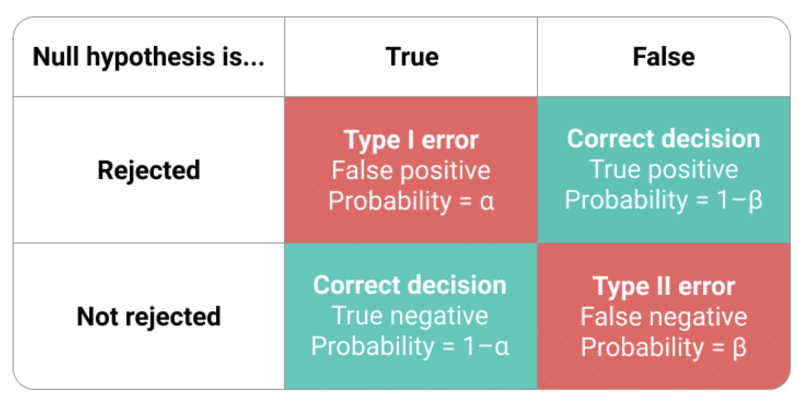

# Основные понятия

$H_0$ - основная гипотеза.

$H_1$ - альтернативная (конкурирующая) гипотеза.

Если не уточняется, о какой гипотезе идет речь, то имеется в виду основная гипотеза. Чаще всего одна гипотеза утверждает, что предположение верно, а другая - что нет.

# Выбираем из двух гипотез!

Мы не просто принимаем или отвергаем определенную гипотезу, а выбираем между двух гипотез. Почему нельзя просто отвергнуть или не отвергнуть основную гипотезу? Зачем обязательно нужна вторая? Дело в том, что бывают ситуации, когда, например, предположение "средние не равны" является слишком общим и включает в себя те случаи, которые нам не интересны. Воспользуемся примером, допустим, нас интересуют, как изменились продажи акций после рекламы.

| Номер случая | Продажи до рекламы (X) |     | Продажи после рекламы (Y) |
|:------------:|:----------------------:|:---:|:-------------------------:|
|      1       |           X            |  =  |             Y             |
|      2       |           X            | !=  |             Y             |
|      3       |           X            | \<  |             Y             |
|      4       |           X            | \>  |             Y             |

: Продажи акций до и после рекламы {tbl-colwidths="\[5, 40, 5, 40\]"}

Информация о том, что продажи не равны нас не очень и устраивает, в чем-то она, конечно, полезна, но все же нам хочется точно знать, выросли продажи или упали. Таким образом основной гипотезой будет выступать случай 1, а альтернативной случай 4.

::: callout-important
# Не умеем!

"Гипотеза справедлива с вероятностью 0.95"
:::

Будет неточным или даже опасным утверждением "основная гипотеза принята..." или "основная гипотеза отвергнута". Правильно говорить "основная гипотеза отвергнута" или "основная гипотеза не отвергнута". Так как обычно проверяют лишь достаточное условие. Мы проверяем не основную гипотезу, а достаточное условие.

::: callout-note
# Пример

Гипотеза: число делится на 6 нацело

Фактически проверяем, делится ли число на 2 нацело
:::

Исходя из условий примера, в ситуации, когда выбранное число на 2 нацело не делится, то мы уверены, что и на 6 нацело оно не делится, а значит основную гипотезу отвергаем. Однако, если число на 2 нацело делится, то хоть и принять основную гипотезу мы не можем, но и отвергнуть ее мы тоже не можем. Отсюда так и получается, что, говоря о статистических гипотезах, мы не можем использовать слово "принимаем", а значит ограничиваемся только "отвергаем" и "не отвергаем".

Конечно, хотя мы и понимаем, что основная гипотеза принята быть не может, но действуем так, будто мы ее принимаем.

# Ошибки первого и второго рода

{width="597" fig-align="center"}

Ошибка I рода состоит в том, что отвергается основная гипотеза, когда на самом деле она верна.

Ошибка II рода состоит в том, что отвергается конкурирующая гипотеза, когда она верна.

::: callout-tip
# Полезное правило

Ошибка I рода тяжелее по своим последствиям
:::

Можно ли свести частоту (вероятность) ошибки I или II рода к нулю? Это возможно, но обычно экономически не целесообразно. Правда, есть исключения, например, всеобщая вакцинация. Возьмем за нулевую гипотезу "человек нуждается в вакцинации", тогда ситуация, при которой он нуждается в вакцинации, но ему ее не сделают (то есть ошибка I рода) стремится к нулю. Однако, тут есть и обратный эффект, так как с уменьшением вероятности ошибки I рода, увеличивается вероятность ошибки II рода.

Таким образом, мы точно знаем, что последствия ошибок могут быть различными, как правило, опаснее ошибки I рода и при проверке статистических гипотез исходят именно из этой предпосылки. Вероятность ошибки первого рода ограничивают вероятностным значением $\alpha$. Отсюда, мы плавно переходим к понятию уровня значимости.

# Уровень значимости

В качестве уровня значимости ($\alpha$) выбирают одно из чисел 0.005, 0.01, 0.05 и (редко) 0.1.

::: callout-tip
Чаще всего уровень значимости равен 0.05
:::

Почему именно такие значения? Это результат консенсуса между практиками и теоретиками. Теоретики уверены, что эти числа придуманы (заказаны им) практиками, а практики уверены, что они каким-то образом выведены теоретиками. Как результат, все этими числами довольны.

На самом деле выбор уровня значимости - большая проблема! Зависит, например, от числа наблюдений! Лучше смотреть, какие уровни значимости берутся в той области, в которой собираемся работать. Например, в работе атомной электростанции уровень значимости 0.05 неприемлем, так как это слишком большой риск.

Применяем критерий так, чтобы вероятность ошибки первого рода равнялась уровню значимости. А что насчет вероятности ошибки II рода? Очень тяжело добиться снижения вероятности ошибки II рода, нужно использовать статистические тесты, статистические критерии, которые состоятельны. Состоятельный статистический критерий — это такой критерий, у которого с ростом числа наблюдений вероятность ошибки II рода стремится к нулю.

::: callout-tip
Большие выборки необходимы, чтобы уменьшить вероятность ошибки II рода
:::

Но, если выборка маленькая и увеличить ее не удается, то есть несколько методов:

1.  "зажмуриться, сделать вид, что ничего не произошло" то есть проигнорировать вероятность ошибки II рода, применить процедуру и использовать результат; такой метод скорее недопустим, так как вероятность ошибки II рода будет слишком большой, что исказит результат

2.  увеличить вероятность ошибки I рода, то есть увеличить уровень значимости (например, до 0.15 или 0.2), чтобы сделать вероятности ошибок сопоставимыми

# Алгоритм проверки статистических гипотез

1.  Определяем основную и альтернативную гипотезу

2.  Определяем уровень значимости $\alpha$ (вероятность ошибки I рода)

3.  Определяем, какой статистический критерий будем использовать

4.  Проверяем все условия, при которых критерий будет работать. Условия берем из учебника или справочника.

5.  Находим p-value/значимость (significance)

6.  Если p-value \< $\alpha$ - гипотезу отвергаем, если p-value \> $\alpha$ - не отвергаем

Что же такое p-value? Вот несколько определений, взятых из книги "Практическая статистика для специалистов Data Science".

1.  p-value — это вероятность, которая приводит к результатам, таким же предельным, какими могут оказаться наблюдаемые результаты с учетом модели нулевой гипотезы.

2.  С учетом случайной модели, которая воплощает нулевую гипотезу, p-значение является вероятностью получения столь же необычных или предельных результатов, что и наблюдаемые результаты.

3.  Это частота, с которой случайная модель приводит к результату, более предельному, чем наблюдаемый результат.

Когда мы смотрим на значение p-value, чтобы отвергнуть или не отвергнуть нулевую гипотезу, мы фактически пытаемся ответить на вопрос "дает ли эксперимент более предельный результат, чем тот, который может породить случайность". И если результат лежит за рамками случайной вариации, то есть значение p-value \< принятого нами $\alpha$, он является *статистически значимым*.
